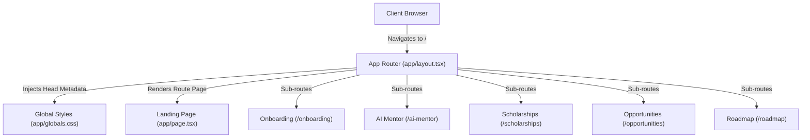

# CampusOS

> **The Operating System for Karnataka Engineering Students.**

[](https://nextjs.org/)
[](https://react.dev/)
[](https://www.typescriptlang.org/)
[](https://tailwindcss.com/)
[](LICENSE)
[](#current-progress)

---

## Problem Statement

First-year engineering students across VTU-affiliated and autonomous colleges in Karnataka face severe information clutter and academic fragmentation:

1. **Information Overwhelm**: Students are inundated with 40+ unorganized WhatsApp and Telegram groups containing over 500 daily forwarded messages, lost PDFs, and outdated syllabus links.
2. **Attendance Cutoff Anxiety**: The mandatory 75% VTU attendance threshold leads to last-minute detention panic, condonation list surprises, and hall ticket holds due to lack of predictive tracking.
3. **CIE & Exam Confusion**: Complex Continuous Internal Evaluation (CIE) weightage rules (IA1, IA2, IA3, Lab CIE) leave students uncertain about the exact marks required to maintain a high SGPA.
4. **Lack of Peer & Senior Guidance**: Viva preparation, lab shortcuts, and repeated PYQs (Previous Year Questions) remain locked within word-of-mouth senior networks rather than accessible structured playbooks.

---

## Vision

CampusOS is designed as a **unified, zero-noise digital workspace** that replaces chaotic chat forwards with a calm, high-precision operating system. It provides VTU and autonomous engineering students in Karnataka with auto-synced syllabus tracking, real-time attendance risk defense, verified senior playbooks, and day-one career skill roadmaps.

---

## Features Completed

- [x] **Interactive Product Showcase & Hero Landing**: Responsive landing page with dark-mode aesthetic, social proof counters, and interactive feature breakdowns.
- [x] **Live CIE & Attendance Risk Simulator**: Real-time slider calculations predicting safe bunk allowances and required IA test scores for target SGPAs.
- [x] **Interactive OS Workspace Mockup**: Tabbed dashboard preview (`Academic Command`, `CIE Radar`, `Senior Playbooks`, `Skill Path`) simulating the core student interface.
- [x] **Student Onboarding Engine (`/onboarding`)**: 4-step interactive onboarding flow capturing college, branch, grading scheme, academic target, and skill focus.
- [x] **AI Academic Mentor Interface (`/ai-mentor`)**: Conversational AI assistant UI tailored for VTU 2022/2025 scheme query resolution.
- [x] **Scholarship & Financial Aid Finder (`/scholarships`)**: Searchable portal for SSP Karnataka, NSP, and merit-based private scholarships.
- [x] **Opportunity & Internship Radar (`/opportunities`)**: Aggregator UI for Karnataka tech hackathons, IEEE/GDSC club events, and 1st-year internship alerts.
- [x] **1st-Year Skill & Career Progression (`/roadmap`)**: Structured technical progression roadmap from C/Python basics to LeetCode starter sets and GitHub proof-of-work.

---

## Planned Features

- [ ] **Backend Database Integration**: PostgreSQL / Cloud Firestore schema for persistent user profiles and attendance tracking.
- [ ] **Real-Time Attendance Sync**: Mobile-responsive daily class log with push notification alerts when attendance dips near 75%.
- [ ] **Verified PYQ & Viva Bank**: Community-contributed lab viva questions and verified previous-year question solutions.
- [ ] **Peer Hackathon Team Matcher**: Karnataka-wide student search for hackathon teammates and project collaborators.

---

## Tech Stack

| Category | Technology | Version | Purpose |
| :--- | :--- | :--- | :--- |
| **Framework** | Next.js (App Router) | `16.2.12` | Server-Side Rendering, Turbopack, App Routing |
| **Library** | React | `19.2.4` | UI Component Lifecycle & State Management |
| **Language** | TypeScript | `5.0+` | Static Type Safety & Developer Autocomplete |
| **Styling** | Tailwind CSS | `v4.0` | Engine directives, `@theme inline`, Glassmorphism |
| **Icons** | Lucide React | `1.28.0` | Modern SVG Icon Suite |

---

## Folder Structure

```
campusos/
├── app/
│   ├── ai-mentor/            # AI Academic Mentor route
│   │   └── page.tsx
│   ├── onboarding/           # Student Onboarding Flow route
│   │   └── page.tsx
│   ├── opportunities/        # Internships & Hackathons route
│   │   └── page.tsx
│   ├── roadmap/              # Skill Progression route
│   │   └── page.tsx
│   ├── scholarships/         # Karnataka Scholarships route
│   │   └── page.tsx
│   ├── favicon.ico
│   ├── globals.css           # Design system tokens & Tailwind v4
│   ├── layout.tsx            # Root HTML layout & Metadata
│   └── page.tsx              # Main Landing & OS Simulator
├── docs/                     # Technical Documentation & Specifications
│   ├── 01-page-tsx-explained.md
│   ├── 02-layout-tsx-explained.md
│   ├── 03-globals-css-explained.md
│   ├── ARCHITECTURE.md
│   ├── CHANGELOG.md
│   ├── FOLDER_STRUCTURE.md
│   ├── LEARNING_NOTES.md
│   ├── PROJECT_OVERVIEW.md
│   └── UI_DESIGN_SYSTEM.md
├── public/                   # Static assets & public media
├── CampusOS_Dashboard_UX_Specification.md
├── CampusOS_Product_Architecture_Specification.md
├── CampusOS_UI_Design_System_Specification.md
├── package.json
├── tsconfig.json
└── README.md
```

---

## Screenshots (placeholders)

| Landing Hero & OS Mockup | CIE & Attendance Simulator |
| :---: | :---: |
|  |  |

| Onboarding Flow (`/onboarding`) | AI Mentor Interface (`/ai-mentor`) |
| :---: | :---: |
|  |  |

---

## Installation

### Prerequisites
* **Node.js**: `v18.17.0` or higher
* **Package Manager**: `npm` (v9+) or `pnpm`

### Step 1: Clone Repository
```bash
git clone https://github.com/your-username/campusos.git
cd campusos
```

### Step 2: Install Dependencies
```bash
npm install
```

---

## Running Locally

Start the local development server with Next.js Turbopack:

```bash
npm run dev
```

Open [http://localhost:3000](http://localhost:3000) in your browser to view the application.

---

## Project Architecture



---

## Current Progress

* **Current Release**: `v0.1.0` (*Design Prototype*)
* **Build Verification**: Clean production compilation via `npm run build`.
* **Design Alignment**: 100% compliant with Karnataka VTU 2022/2025 scheme specifications and dark-mode glassmorphic design standards.

---

## Roadmap

- [x] **v0.1.0 (Q3 2026)**: Initial UI Design System & Component Prototypes.
- [ ] **v0.2.0 (Q4 2026)**: Authentication System & Student Profile Persistence.
- [ ] **v0.3.0 (Q1 2027)**: Real-time Attendance & CIE Calculator API Backend.
- [ ] **v1.0.0 (Q2 2027)**: Full Production Launch across Karnataka Engineering Campuses.

---

## Future Scope

1. **Autonomous College Plugin Engine**: Allow students from autonomous colleges (RVCE, BMSCE, PES, MSRIT) to upload custom credit maps and grading rubrics.
2. **AI Exam Readiness Predictor**: Machine learning model analyzing historical student CIE scores to predict End-Sem (SEE) grade distributions.
3. **VTU Circular Verification Bot**: Automatic scraping and authenticity verification of official VTU announcements.

---

## Author

**CampusOS Team**  
*Built with ❤️ for Engineering Students across Karnataka.*  
GitHub: [@campusos](https://github.com/campusos)  

---
*License: MIT*
