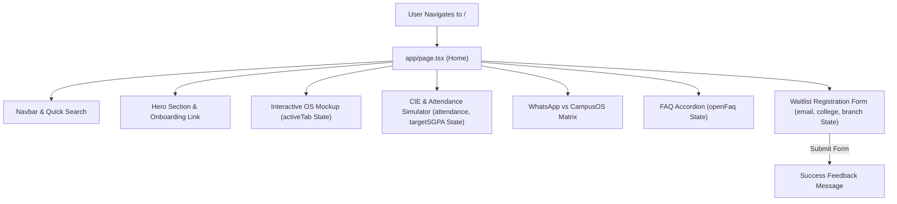

# `app/page.tsx`

## Purpose of this file

`app/page.tsx` is the primary entrypoint page component for the **CampusOS** platform under the Next.js App Router root path (`/`).

It exists to:
1. **Render the CampusOS Landing & Product Overview**: Serve an immersive, high-conversion landing page presenting the core value proposition of CampusOS for Karnataka engineering students.
2. **Provide Interactive Product Demos**: Feature interactive state-driven tab switchers (`Academics`, `CIE & Attendance Radar`, `Senior Playbooks`, `Skill & Career Path`) that demonstrate the CampusOS student dashboard experience in real-time.
3. **Execute Live Calculators**: Run interactive client-side calculators for predicting VTU 75% attendance risk and calculating target Continuous Internal Evaluation (CIE) exam scores needed to hit specific SGPA targets.
4. **Capture Early Access Registrations**: Host the student waitlist form collecting college names, engineering branches, and email addresses.

---

## When is it executed?

As a Client Component (`"use client"`), `app/page.tsx` undergoes a two-phase lifecycle:

### Execution Lifecycle:
1. **Server SSR Pre-rendering**: On initial page request (`/`), Next.js pre-renders the initial state markup of `page.tsx` inside `app/layout.tsx` on the server to output fast static HTML for SEO indexing.
2. **Client Hydration**: The browser receives the pre-rendered HTML, downloads the JavaScript bundle, attaches React event handlers (`onClick`, `onChange`, `onSubmit`), and initializes client state (`useState`).
3. **Interactive Re-rendering**: User actions (sliding the attendance slider, changing tabs, clicking FAQ accordions) trigger React state updates, re-rendering affected UI blocks dynamically at 60 FPS without page reloads.

---

## Imports

### `"use client";` (Line 1)
* **What it is**: Next.js App Router boundary directive signaling that this file and its child component tree run on the browser DOM.
* **Why it is used**: Required because the component uses React hooks (`useState`), event handlers (`onClick`, `onChange`, `onSubmit`), and dynamic DOM interactivity.
* **What happens if removed**: Next.js will treat `page.tsx` as a Server Component and fail with a compilation error when encountering `useState` or event handlers.

### `import React, { useState } from "react";` (Line 3)
* **What it is**: Imports core React library and `useState` hook for local component state management.
* **Why it is used**: Manages state for active workspace tabs, attendance percentage, target SGPA, waitlist form inputs, and open FAQ accordion indices.
* **What happens if removed**: `useState` will throw a reference error (`useState is not defined`).

### `import { BookOpen, Calendar, ... } from "lucide-react";` (Lines 4-36)
* **What it is**: Import of 33 vector icons from the modern `lucide-react` icon library.
* **Why it is used**: Visually enriches navigation bars, feature cards, tab controls, status indicators, and call-to-action buttons.
* **What happens if removed**: Icon component tags like `<BookOpen />` will fail with reference errors.

---

## Code Walkthrough

### Lines 1-36: Directives & Package Imports
* Declares `"use client"` directive, React hooks, and Lucide React UI icons.

### Lines 38-219: Static Mock Data Structures
* **`workspaceTabs` (Lines 38-64)**: Configuration array defining workspace demo tabs (Academic Command, CIE Radar, Senior Playbooks, Skill Roadmap) with labels, icons, and badges.
* **`karnatakaColleges` (Lines 66-81)**: List of top engineering colleges in Karnataka (RVCE, BMSCE, PES, MSRIT, NMIT, GIT, NIE, SIT, SJCE, VTU Main Campus).
* **`engineeringBranches` (Lines 83-92)**: List of major engineering disciplines (CSE, ISE, AI & ML, ECE, EEE, Mech, Civil, Biotech).
* **`featuresList` (Lines 94-149)**: Array of 6 core feature cards detailing syllabus engine, CIE risk radar, senior playbooks, placement roadmaps, verified feeds, and tech club networks.
* **`journeySteps` (Lines 151-200)**: 4-phase timeline mapping student progression from Month 0 induction to Year 2+ placements.
* **`faqs` (Lines 202-219)**: Frequently Asked Questions array with question-and-answer pairs.

### Lines 221-236: State Initialization inside `Home()` Component
* **`activeTab` (`useState("academics")`)**: Tracks the selected workspace tab ID.
* **`activeJourney` (`useState(0)`)**: Tracks the active timeline step index in the student journey section.
* **`attendance` (`useState<number>(82)`)**: Tracks current attendance percentage on the simulator slider.
* **`targetSGPA` (`useState<number>(8.5)`)**: Tracks target SGPA on the simulator slider.
* **`email`, `college`, `branch`, `submitted`**: State hooks managing waitlist form inputs and submission feedback.
* **`openFaq` (`useState<number | null>(0)`)**: Tracks the currently expanded FAQ item index.

### Lines 238-248: Form Handler & Derived Calculations
* **`handleWaitlistSubmit`**: Form submit handler setting `submitted = true`.
* **`bunkAllowance` (`Math.max(0, Math.floor((attendance - 75) / 2.5))`)**: Calculates the exact number of classes a student can safely miss above 75%.
* **`reqIAMarks` (`Math.min(40, Math.max(16, Math.round(targetSGPA * 4)))`)**: Calculates required internal test marks out of 40 based on target SGPA.

### Lines 250 border-1215: JSX Layout Structure

#### 1. Header & Navigation (Lines 257-310)
* Sticky backdrop-blurred navigation header featuring the CampusOS logo, badge, navigation links, quick search shortcut (`⌘K`), and waitlist CTA button.

#### 2. Hero Section (Lines 312-383)
* Headline section with glowing badge, gradient typography (`The Operating System for Engineering Life`), subtitle, primary onboarding CTA button, and social proof stats.

#### 3. Interactive OS Demo Workspace (Lines 385-725)
* Linear/Notion-inspired OS window mockup with simulated Mac control buttons, active workspace tabs, subject sidebar, and dynamic tab views (Academics, Attendance Radar, Senior Intel, Skill Roadmap).

#### 4. Feature Suite Grid (Lines 727-767)
* 6-card feature grid with glassmorphism backgrounds and gradient icons.

#### 5. Live CIE & Attendance Risk Simulator (Lines 769-887)
* Interactive sliders allowing users to adjust attendance (50-100%) and target SGPA (6.0-10.0), updating calculated bunk allowance and required IA scores in real-time.

#### 6. Student Journey & WhatsApp Chaos Matrix (Lines 889-1025)
* Timeline stepper contrasting the chaotic WhatsApp group experience against the organized CampusOS platform.

#### 7. FAQ Accordion & Why Us Section (Lines 1027-1086)
* Collapsible accordion resolving common student questions.

#### 8. Early Access Waitlist Form (Lines 1088-1182)
* College selector, branch selector, and student email registration form with success confirmation feedback.

#### 9. Footer (Lines 1184-1212)
* Responsive footer links, VTU 2025 scheme badge, and copyright notice.

---

## Component Flow

---

## Interview Questions

### Q1: Why is `use client` required at the top of `app/page.tsx`?
**Answer**: In Next.js App Router, all components are Server Components by default. Because `app/page.tsx` uses state hooks (`useState`), event handlers (`onClick`, `onChange`, `onSubmit`), and dynamic DOM interactions, it must be marked as a Client Component using `"use client"`.

### Q2: What is the performance advantage of derived state calculations (`bunkAllowance`, `reqIAMarks`) over storing them in state?
**Answer**: Storing derived values directly in `useState` creates redundant state synchronization overhead and requires extra `useEffect` re-renders. Calculating derived values synchronously during render ensures optimal performance and prevents out-of-sync state bugs.

### Q3: How does state isolation work in complex single-page layout views?
**Answer**: Component state variables (`activeTab`, `attendance`, `openFaq`) isolate UI changes locally. When the attendance slider moves, React only re-evaluates the simulator widget DOM tree while leaving static sections like the navbar and hero un-mutated.

---

## Key Concepts Learned

* **Client Component Architecture**: Utilizing `"use client"` for interactive pages.
* **Derived State Optimization**: Calculating dependent values directly during component render.
* **Interactive UI Mockups**: Building realistic multi-tab workspace previews in React.
* **Controlled Form Inputs**: Binding React state (`value`, `onChange`) to HTML form controls.
* **Glassmorphic Component Design**: Combining Tailwind CSS glass panels, ambient radial glows, and responsive grids.

---

## Beginner Notes

* **`useState` Hook**: `const [value, setValue] = useState(initial)` stores data that can change over time. Calling `setValue(newValue)` tells React to re-render the UI with updated values.
* **Controlled Form Inputs**: Setting `value={email}` and `onChange={(e) => setEmail(e.target.value)}` forces the HTML `<input>` to stay perfectly synced with React state.
* **Derived Variables**: `bunkAllowance` is not stored in state; it is automatically re-calculated whenever `attendance` state changes!

---

## What I Should Remember

1. **`"use client"` directive** is mandatory at line 1 when using state or event listeners in App Router pages.
2. **Derived variables** (like `bunkAllowance`) should be calculated during render rather than stored in state.
3. **Mock arrays** (`workspaceTabs`, `faqs`) keep JSX lean and maintainable.
4. **Controlled inputs** ensure form data is captured accurately before submission.
5. **Backdrop blur and glassmorphic panels** create a sleek, modern visual aesthetic.

---

## Common Mistakes Beginners Make

* **Mistake 1**: Creating unnecessary `useEffect` hooks to update derived calculations whenever slider state changes.
* **Mistake 2**: Forgetting `"use client"` on interactive pages containing `useState` or `onClick` handlers.
* **Mistake 3**: Putting huge inline data objects directly inside JSX render functions, causing unnecessary re-allocations on every render.

---

## Practice Challenge

Without looking at the code, recreate the interactive calculator widget from `app/page.tsx`!

### Hints:
1. Create state for `attendance` (`useState(82)`) and `targetSGPA` (`useState(8.5)`).
2. Calculate `bunkAllowance = Math.max(0, Math.floor((attendance - 75) / 2.5))`.
3. Render two `<input type="range" />` elements bound to `attendance` and `targetSGPA`.
4. Display the calculated bunk allowance and required IA score inside a glassmorphic card container.
