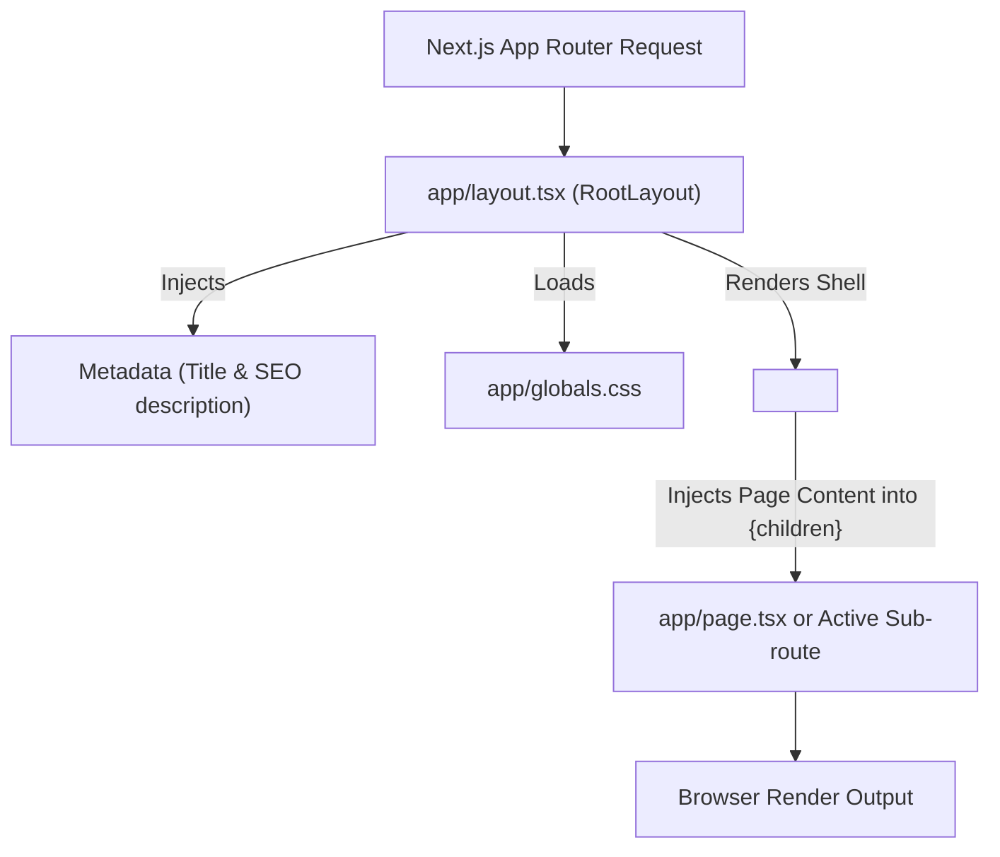

# `app/layout.tsx`

## Purpose of this file

`app/layout.tsx` is the top-level **Root Layout** component required by Next.js App Router applications.

It exists to:
1. **Provide the Document Shell**: Render the mandatory root `<html>` and `<body>` HTML tags for all routes.
2. **Inject Global Styles**: Import `globals.css` so design system styles and Tailwind CSS apply across the entire application.
3. **Define Application Metadata**: Export static or dynamic Next.js `Metadata` objects (page titles, meta descriptions, open graph tags) for SEO and browser tab display.
4. **Preserve Layout State**: Ensure layout containers and UI wrappers stay mounted when users navigate between sub-pages (`/ai-mentor`, `/scholarships`, `/roadmap`, etc.).

---

## When is it executed?

`app/layout.tsx` is the first React component executed during both server-side rendering (SSR) and client-side hydration.

### Execution Lifecycle:
1. **Server Request Phase**: When an HTTP request reaches Next.js, Next.js executes `RootLayout` on the server.
2. **Head & Metadata Injection**: Next.js evaluates the exported `metadata` object and automatically injects `<title>`, `<meta name="description">`, and `<link>` tags into the document head.
3. **HTML Streaming**: Next.js streams the server-rendered `<html>...</html>` document tree containing the nested page component (`children`) to the client.
4. **Client Hydration**: The browser parses the HTML, loads JavaScript bundles, and hydrates interactive components while preserving the root layout structure.

---

## Imports

### `import type { Metadata } from "next";` (Line 1)
* **What it is**: Type-only import of Next.js's built-in `Metadata` interface from the `"next"` package.
* **Why it is used**: Provides strict TypeScript autocomplete and validation for page title, description, open-graph cards, and favicon properties. Using `import type` guarantees that type definitions are stripped away during compilation, keeping the output JavaScript bundle lean.
* **What happens if it is removed**: The `metadata` object declaration will throw a TypeScript compilation error (`Cannot find name 'Metadata'`).

### `import "./globals.css";` (Line 2)
* **What it is**: Side-effect CSS import loading the primary stylesheet ([`app/globals.css`](file:///C:/Projects/campusos/app/globals.css)).
* **Why it is used**: Injects Tailwind CSS v4, custom glassmorphism utilities, CSS design tokens (`:root`), and global element resets into every page.
* **What happens if it is removed**: All styling across the application breaks, reverting all pages to unstyled browser-default HTML text and layout.

---

## Code Walkthrough

### Line 1: `import type { Metadata } from "next";`
* **What it does**: Imports the `Metadata` TypeScript type definition from Next.js.
* **Why it exists**: Enables type safety for the `metadata` export.
* **How it works**: TypeScript type checker validates that the `metadata` object properties match Next.js specification.
* **Alternative approaches**: Omitting type annotation (`export const metadata = { ... }`), which loses strict type checking for metadata keys.

### Line 2: `import "./globals.css";`
* **What it does**: Imports `globals.css` into the application root.
* **Why it exists**: Applies global CSS styles.
* **How it works**: Next.js bundler extracts imported CSS and links it in the document `<head>`.
* **Alternative approaches**: Importing CSS files inside specific sub-components (not supported in Next.js App Router for global styles).

### Line 3: *(Blank Line)*
* **What it does**: Vertical spacing for code clarity.

### Line 4: `export const metadata: Metadata = {`
* **What it does**: Declares and exports a named constant `metadata` of type `Metadata`.
* **Why it exists**: Next.js App Router automatically reads exported `metadata` constants from layouts and pages to build HTML metadata tags.
* **How it works**: Next.js evaluates this object on the server and generates HTML `<head>` tags.
* **Alternative approaches**: Legacy Next.js `pages/_app.tsx` used `<Head>` components from `next/head`.

### Line 5: `  title: "CampusOS | Student operating system for engineering",`
* **What it does**: Sets the browser tab title to `"CampusOS | Student operating system for engineering"`.
* **Why it exists**: Identifies the site in browser tabs and search engine result titles (SERPs).
* **How it works**: Rendered as `<title>CampusOS | Student operating system for engineering</title>`.

### Line 6: `  description:`
* **What it does**: Begins multi-line string property key for metadata description.

### Line 7: `    "A premium student workspace for first-year engineering students in Karnataka.",`
* **What it does**: Sets text description for search engines and social sharing link previews.
* **Why it exists**: Improves SEO indexability and click-through rates.
* **How it works**: Rendered as `<meta name="description" content="A premium student workspace...">`.

### Line 8: `};`
* **What it does**: Closes `metadata` object.

### Line 9: *(Blank Line)*

### Line 10: `export default function RootLayout({`
* **What it does**: Declares and exports the default React functional component named `RootLayout`.
* **Why it exists**: Serves as mandatory root component in Next.js App Router.
* **How it works**: Next.js wraps every route page inside this layout component.
* **Alternative approaches**: Class components (deprecated in modern React).

### Line 11: `  children,`
* **What it does**: Destructures the `children` prop from the component props object.
* **Why it exists**: Represents the active page or nested child route being viewed.
* **How it works**: React passes the page component matching the current URL into `children`.

### Line 12: `}: Readonly<{`
* **What it does**: Applies TypeScript `Readonly<T>` utility type to the props object parameter.
* **Why it exists**: Prevents accidental mutation of component props inside the layout function body.
* **How it works**: TypeScript marks all properties inside `{ children: React.ReactNode }` as immutable.

### Line 13: `  children: React.ReactNode;`
* **What it does**: Defines type of `children` as `React.ReactNode`.
* **Why it exists**: Type safety for JSX elements, strings, numbers, or fragments passed to `children`.
* **How it works**: Accepts any valid renderable React content.

### Line 14: `}>) {`
* **What it does**: Closes TypeScript type definition and opens function body block `{`.

### Line 15: `  return (`
* **What it does**: Opens JSX return statement.

### Line 16: `    <html lang="en" className="h-full antialiased">`
* **What it does**: Renders root `<html>` element with `lang="en"`, `h-full`, and `antialiased` utility classes.
* **Why it exists**: Sets document language to English, enforces 100% full height layout, and turns on smooth font antialiasing rendering.
* **How it works**: `antialiased` applies `-webkit-font-smoothing: antialiased; -moz-osx-font-smoothing: grayscale;`.
* **Alternative approaches**: Setting font smoothing rules inside CSS files.

### Line 17: `      <body className="min-h-full flex flex-col">{children}</body>`
* **What it does**: Renders `<body>` tag with flexbox column layout (`min-h-full flex flex-col`) and outputs `{children}`.
* **Why it exists**: Guarantees full-viewport height and allows footers or main content blocks to expand cleanly without unexpected vertical gaps.
* **How it works**: `{children}` renders the active route page content inside the body element.

### Line 18: `    </html>`
* **What it does**: Closes root `<html>` element.

### Line 19: `  );`
* **What it does**: Closes return statement.

### Line 20: `}`
* **What it does**: Closes `RootLayout` function component.

### Line 21: *(Blank Line)*
* **What it does**: Trailing newline.

---

## Component Flow

---

## Interview Questions

### Q1: Why is `app/layout.tsx` mandatory in Next.js App Router?
**Answer**: Next.js App Router does not create default `<html>` or `<body>` elements automatically. The `app/layout.tsx` file is mandatory because it defines the root document markup, global styles, and HTML attributes for the entire application.

### Q2: What is the difference between `Readonly<{ children: React.ReactNode }>` and `{ children: React.ReactNode }`?
**Answer**: `Readonly<T>` is a TypeScript utility type that makes all properties of the prop object immutable, raising compile-time errors if any code attempts to reassign or modify `props.children`.

### Q3: How does layout persistence work during page navigation in App Router?
**Answer**: Unlike Next.js Pages Router where route changes re-rendered the entire page wrapper, App Router preserves layout instances during navigation. Only the `{children}` prop updates, preventing layout state resets and avoiding costly DOM re-creations.

---

## Key Concepts Learned

* **Next.js Root Layout**: Understanding the mandatory top-level document structure component.
* **Metadata API**: Exporting type-safe `Metadata` objects for automated head tag generation.
* **Font Antialiasing (`antialiased`)**: Enabling subpixel font smoothing across browsers.
* **Full-Height Sticky Layouts**: Using `h-full`, `min-h-full`, and `flex flex-col` on html/body containers.
* **TypeScript Immutability (`Readonly<T>`)**: Using TypeScript utility types for component props.

---

## Beginner Notes

* **`{children}`**: In React, `children` is a special prop that automatically holds whatever content is placed *inside* a component tag (e.g., `<RootLayout><Page /></RootLayout>`).
* **`Metadata`**: Next.js reads your `metadata` object automatically on the server and builds `<head>` HTML for you so you don't have to write manual `<meta>` tags.
* **`antialiased`**: Makes text look crisp and thin on modern HD/Retina displays by controlling screen pixel rendering.

---

## What I Should Remember

1. **`app/layout.tsx` is required** in Next.js App Router and must contain `<html>` and `<body>` tags.
2. **`import "./globals.css"`** in `layout.tsx` makes styles globally available across all pages.
3. **`export const metadata: Metadata`** handles page titles and SEO meta tags cleanly on the server.
4. **Layouts preserve state**: Navigating between routes re-renders `{children}` without re-mounting the root layout shell.
5. **Flexbox height resets**: Using `h-full` on `html` and `min-h-full flex flex-col` on `body` provides a solid foundation for full-screen web apps.

---

## Common Mistakes Beginners Make

* **Mistake 1**: Omitting mandatory `<html>` or `<body>` tags inside `RootLayout`, causing Next.js runtime errors.
* **Mistake 2**: Importing `"use client"` inside `RootLayout` when exporting metadata (Metadata exports are only supported in Server Components).
* **Mistake 3**: Forget to pass or render `{children}`, resulting in a completely blank page when navigating to sub-routes.

---

## Practice Challenge

Without looking at the code, recreate `app/layout.tsx` from scratch!

### Hints:
1. Import `Metadata` type from `"next"` and import `"./globals.css"`.
2. Export a `metadata: Metadata` object containing `title` and `description`.
3. Export default function `RootLayout({ children }: Readonly<{ children: React.ReactNode }>)`.
4. Return an `<html>` element with `lang="en"` and `className="h-full antialiased"`.
5. Wrap `{children}` inside a `<body>` tag with `className="min-h-full flex flex-col"`.
