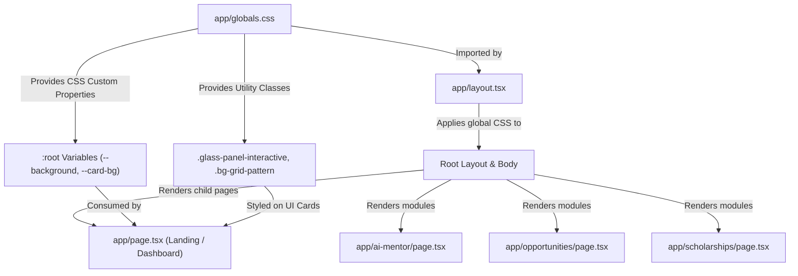

# `app/globals.css`

## Purpose of this file

`app/globals.css` is the core global stylesheet for the **CampusOS** application built with Next.js App Router and Tailwind CSS v4.

It exists to:
1. **Initialize Tailwind CSS v4**: Inject the Tailwind engine and default utility classes into the global scope.
2. **Define Design Tokens**: Declare CSS custom properties (variables) on `:root` for colors, surfaces, glassmorphic opacity, and brand accent colors.
3. **Establish Global Element Defaults**: Set base styling rules for `html`, `body`, and universal selectors (`*`), such as background colors, foreground text colors, default font stacks, box-sizing resets, smooth scrolling, and scrollbar behavior.
4. **Provide Custom UI Utilities**: Supply reusable CSS classes for ambient glowing backgrounds, radial spotlight grids, glassmorphism panels, shimmer keyframe animations, gradient borders, and custom scrollbars.

---

## When is it executed?

`app/globals.css` is imported at the top of the root layout file (`app/layout.tsx`):
```tsx
import "./globals.css";
```

### Execution Lifecycle:
1. **Build / Compilation Phase**: When Next.js compiles the application (via PostCSS / Lightning CSS), `@import "tailwindcss";` and custom CSS rules are parsed, bundled, and optimized into static CSS files.
2. **Server-Side Rendering (SSR)**: When a page is requested, Next.js injects the compiled CSS link or `<style>` tags directly into the `<head>` of the server-rendered HTML document.
3. **Browser Load Phase**: The browser parses `globals.css` before evaluating JavaScript, ensuring zero layout shift (CLS) and preventing unstyled content flash (FOUC).
4. **Runtime / Interactivity Phase**: Dynamic CSS variables (such as `--mouse-x` and `--mouse-y`) updated by JavaScript listeners dynamically update styles styled by `globals.css` at 60 FPS without triggering React re-renders.

---

## Imports

### `@import "tailwindcss";` (Line 1)
* **What it is**: The official entrypoint directive for Tailwind CSS v4.
* **Why it is used**: It imports the Tailwind engine, base layer resets (Preflight), component classes, and utility utilities into the CSS bundle.
* **What happens if it is removed**: All Tailwind utility classes (`flex`, `grid`, `p-4`, `text-white`, `rounded-xl`, etc.) used across the entire application will break completely, resulting in an unstyled HTML layout.

---

## Code Walkthrough

### Line 1: `@import "tailwindcss";`
* **What it does**: Imports the Tailwind CSS engine and reset rules into the global scope.
* **Why it exists**: Configures Tailwind v4 in Next.js without requiring legacy `@tailwind` directive layers.
* **How it works**: Lightning CSS / PostCSS resolves `@import "tailwindcss";` and injects Tailwind's internal CSS layer definitions.
* **Alternative approaches**: Legacy Tailwind v3 used `@tailwind base; @tailwind components; @tailwind utilities;`.

### Line 2: *(Blank Line)*
* **What it does**: Provides vertical spacing.
* **Why it exists**: Improves code readability.
* **How it works**: Ignored by the CSS parser.

### Line 3: `:root {`
* **What it does**: Opens the pseudo-class selector representing the document root (`<html>`).
* **Why it exists**: Houses global CSS variables accessible to all DOM elements.
* **How it works**: Any variable declared inside `:root` can be accessed using `var(--variable-name)`.
* **Alternative approaches**: Hardcoding hex color strings in individual components or configuring theme colors strictly inside JavaScript configuration files.

### Line 4: `  --background: #08090e;`
* **What it does**: Declares `--background` with deep obsidian dark hex code `#08090e`.
* **Why it exists**: Sets the signature dark canvas color for CampusOS.
* **How it works**: Stores `#08090e` in the variable `--background`.
* **Alternative approaches**: Using Tailwind class `bg-[#08090e]` directly in HTML templates.

### Line 5: `  --foreground: #f3f4f6;`
* **What it does**: Declares `--foreground` with light off-white color `#f3f4f6`.
* **Why it exists**: Guarantees accessible high-contrast text against dark backgrounds.
* **How it works**: Stores `#f3f4f6` in `--foreground`.
* **Alternative approaches**: Setting text color on every component individually.

### Line 6: `  --card-bg: rgba(18, 20, 29, 0.7);`
* **What it does**: Defines `--card-bg` as a 70% opaque dark slate color (`rgba(18, 20, 29, 0.7)`).
* **Why it exists**: Serves as the surface color for glassmorphic cards and containers.
* **How it works**: Uses RGBA alpha channel to enable backdrop transparency.
* **Alternative approaches**: Hex codes without alpha channel transparency.

### Line 7: `  --accent-purple: #7c3aed;`
* **What it does**: Defines `--accent-purple` as `#7c3aed` (Violet 600).
* **Why it exists**: Establishes the primary brand color for active states and glows.
* **How it works**: Stores hex value for reusable styling reference.
* **Alternative approaches**: Defining inline color values in utility classes.

### Line 8: `  --accent-blue: #3b82f6;`
* **What it does**: Defines `--accent-blue` as `#3b82f6` (Blue 500).
* **Why it exists**: Secondary accent for gradients, buttons, and secondary highlights.
* **How it works**: Stores blue hex value in CSS custom property.
* **Alternative approaches**: Using static utility classes without theme variables.

### Line 9: `  --accent-cyan: #06b6d4;`
* **What it does**: Defines `--accent-cyan` as `#06b6d4` (Cyan 500).
* **Why it exists**: Highlights status badges, active indicators, and AI mentor elements.
* **How it works**: Stores cyan hex value.
* **Alternative approaches**: Ad-hoc color strings.

### Line 10: `  --accent-emerald: #10b981;`
* **What it does**: Defines `--accent-emerald` as `#10b981` (Emerald 500).
* **Why it exists**: Indicates positive metrics, success states, and scholarship match percentages.
* **How it works**: Stores emerald green hex value.
* **Alternative approaches**: Hardcoded green inline styles.

### Line 11: `}`
* **What it does**: Closes `:root` selector block.
* **Why it exists**: Ends scope for `:root` variable definitions.
* **How it works**: CSS parser closes scope.

### Line 12: *(Blank Line)*
* **What it does**: Readability spacing.

### Line 13: `@theme inline {`
* **What it does**: Declares a Tailwind CSS v4 inline theme configuration block.
* **Why it exists**: Integrates standard CSS variables directly with Tailwind utility generation.
* **How it works**: Tells Tailwind engine to generate classes like `bg-background` and `text-foreground`.
* **Alternative approaches**: In Tailwind v3, this was done inside `tailwind.config.js`.

### Line 14: `  --color-background: var(--background);`
* **What it does**: Maps Tailwind `--color-background` token to `var(--background)`.
* **Why it exists**: Allows `bg-background` utility class to dynamically output `#08090e`.
* **How it works**: Binds Tailwind utility to CSS custom property.
* **Alternative approaches**: Manually defining `.bg-background { background: var(--background); }`.

### Line 15: `  --color-foreground: var(--foreground);`
* **What it does**: Maps Tailwind `--color-foreground` token to `var(--foreground)`.
* **Why it exists**: Allows `text-foreground` utility class to output `#f3f4f6`.
* **How it works**: Binds Tailwind text utility to CSS custom property.
* **Alternative approaches**: Manually writing text classes.

### Line 16: `}`
* **What it does**: Closes `@theme inline` block.

### Line 17: *(Blank Line)*
* **What it does**: Readability spacing.

### Line 18: `body {`
* **What it does**: Opens element selector block for document `<body>`.
* **Why it exists**: Applies application-wide base typography and background defaults.
* **How it works**: Rules inside apply to all DOM nodes inside `<body>`.

### Line 19: `  background-color: var(--background);`
* **What it does**: Sets main page background to `#08090e`.
* **Why it exists**: Prevents white screen flashing during page transitions.
* **How it works**: Evaluates `var(--background)` and applies color to body layer.
* **Alternative approaches**: Adding `class="bg-[#08090e]"` on `<body />`.

### Line 20: `  color: var(--foreground);`
* **What it does**: Sets default body text color to `#f3f4f6`.
* **Why it exists**: Ensures default dark-mode text readability across all pages.
* **How it works**: Inherited by child text elements unless overridden.

### Line 21: `  font-family:`
* **What it does**: Begins font-family property declaration.

### Line 22: `    Inter, -apple-system, BlinkMacSystemFont, "Segoe UI", Roboto, Oxygen, Ubuntu, Cantarell, "Open Sans", "Helvetica Neue", sans-serif;`
* **What it does**: Sets primary modern sans-serif typography stack with cross-platform system fallbacks.
* **Why it exists**: Ensures clean, modern typography across macOS, iOS, Windows, Android, and Linux.
* **How it works**: Browser attempts to render `Inter`; falls back to system fonts if `Inter` is not loaded.
* **Alternative approaches**: Loading fonts via standard standard link tags or `@font-face`.

### Line 23: `  overflow-x: hidden;`
* **What it does**: Hides horizontal scrollbars on the body element.
* **Why it exists**: Prevents horizontal layout shifts caused by wide ambient radial glow graphics.
* **How it works**: Clips any content extending beyond 100vw horizontally.
* **Alternative approaches**: Adding `overflow-x-hidden` utility on wrapping container `div`s.

### Line 24: `}`
* **What it does**: Closes `body` block.

### Line 25: *(Blank Line)*
* **What it does**: Readability spacing.

### Line 26: `* {`
* **What it does**: Universal selector targeting all DOM elements.

### Line 27: `  box-sizing: border-box;`
* **What it does**: Enforces `border-box` layout sizing model globally.
* **Why it exists**: Ensures padding and border widths are included within specified element dimensions.
* **How it works**: Prevents elements from bursting container bounds when padding is added.
* **Alternative approaches**: Relying on Tailwind Preflight default reset.

### Line 28: `}`
* **What it does**: Closes universal selector block.

### Line 29: *(Blank Line)*
* **What it does**: Readability spacing.

### Line 30: `html {`
* **What it does**: Targets root `<html>` element.

### Line 31: `  scroll-behavior: smooth;`
* **What it does**: Enables smooth scrolling across anchor navigation links (`#section-id`).
* **Why it exists**: Provides polished UX when jumping to page sections.
* **How it works**: Interpolates scroll position smoothly over time instead of instant snapping.
* **Alternative approaches**: JavaScript smooth scroll handlers (`window.scrollTo({ behavior: 'smooth' })`).

### Line 32: `}`
* **What it does**: Closes `html` rule block.

### Line 33: *(Blank Line)*
* **What it does**: Readability spacing.

### Line 34: `/* Background Grids & Glows */`
* **What it does**: CSS section divider comment.

### Line 35: `.bg-grid-pattern {`
* **What it does**: Declares utility class for ambient dot grid pattern.

### Line 36: `  background-image: radial-gradient(rgba(255, 255, 255, 0.12) 1px, transparent 1px);`
* **What it does**: Generates a grid of 1px white dots with 12% opacity.
* **Why it exists**: Creates subtle tech-themed ambient background texture.
* **How it works**: Renders repeated radial gradient dots.
* **Alternative approaches**: PNG or SVG tile background images.

### Line 37: `  background-size: 24px 24px;`
* **What it does**: Spaces dot grid 24px apart horizontally and vertically.
* **Why it exists**: Controls grid pattern density.

### Line 38: `}`
* **What it does**: Closes `.bg-grid-pattern`.

### Line 39: *(Blank Line)*

### Line 40: `.bg-radial-glow {`
* **What it does**: Class for static top ambient lighting glow.

### Line 41: `  background: radial-gradient(circle at 50% 0%, rgba(124, 58, 237, 0.18) 0%, rgba(59, 130, 246, 0.08) 45%, transparent 70%);`
* **What it does**: Projects soft purple and blue ambient lighting from top-center.
* **Why it exists**: Gives hero section depth and futuristic aura.
* **How it works**: Multi-stop radial gradient centered at top middle (`50% 0%`).

### Line 42: `}`
* **What it does**: Closes `.bg-radial-glow`.

### Line 43: *(Blank Line)*

### Line 44: `.bg-radial-hero {`
* **What it does**: Class for interactive cursor spotlight glow.

### Line 45: `  background: radial-gradient(800px circle at var(--mouse-x, 50%) var(--mouse-y, 20%), rgba(124, 58, 237, 0.15), transparent 40%);`
* **What it does**: Renders an 800px spotlight following `--mouse-x` and `--mouse-y` variables.
* **Why it exists**: Creates immersive interactive lighting response as cursor moves.
* **How it works**: Dynamically recalculates gradient position based on CSS custom properties.

### Line 46: `}`
* **What it does**: Closes `.bg-radial-hero`.

### Line 47: *(Blank Line)*

### Line 48: `/* Glassmorphism */`
* **What it does**: Section comment.

### Line 49: `.glass-panel {`
* **What it does**: Static frosted glass container utility class.

### Line 50: `  background: rgba(15, 17, 26, 0.75);`
* **What it does**: Sets dark 75% translucent surface color.

### Line 51: `  backdrop-filter: blur(16px);`
* **What it does**: Blurs content behind the container by 16px.
* **Why it exists**: Core element of glassmorphic UI design system.

### Line 52: `  -webkit-backdrop-filter: blur(16px);`
* **What it does**: WebKit vendor prefix for Safari browser compatibility.

### Line 53: `  border: 1px solid rgba(255, 255, 255, 0.08);`
* **What it does**: Applies 8% opacity translucent white edge line.
* **Why it exists**: Separates glass panels from dark background.

### Line 54: `}`
* **What it does**: Closes `.glass-panel`.

### Line 55: *(Blank Line)*

### Line 56: `.glass-panel-interactive {`
* **What it does**: Base class for hoverable glass cards.

### Line 57: `  background: rgba(18, 20, 31, 0.65);`
* **What it does**: Sets 65% opacity base color.

### Line 58: `  backdrop-filter: blur(16px);`
* **What it does**: Blurs background content.

### Line 59: `  border: 1px solid rgba(255, 255, 255, 0.08);`
* **What it does**: Adds translucent border line.

### Line 60: `  transition: all 0.25s cubic-bezier(0.16, 1, 0.3, 1);`
* **What it does**: Smooth custom deceleration curve for hover state transitions over 250ms.

### Line 61: `}`
* **What it does**: Closes `.glass-panel-interactive`.

### Line 62: *(Blank Line)*

### Line 63: `.glass-panel-interactive:hover {`
* **What it does**: Hover state for interactive cards.

### Line 64: `  background: rgba(24, 27, 42, 0.85);`
* **What it does**: Increases background opacity to 85% on hover.

### Line 65: `  border-color: rgba(167, 139, 250, 0.3);`
* **What it does**: Highlights border edge with glowing purple (`rgba(167, 139, 250, 0.3)`).

### Line 66: `  box-shadow: 0 8px 30px rgba(0, 0, 0, 0.4), 0 0 20px rgba(124, 58, 237, 0.15);`
* **What it does**: Combines shadow elevation with outer purple neon glow.

### Line 67: `  transform: translateY(-2px);`
* **What it does**: Moves card upward by 2px to simulate physical elevation.

### Line 68: `}`
* **What it does**: Closes hover block.

### Line 69: *(Blank Line)*

### Line 70: `/* Shimmer & Glow Animations */`
* **What it does**: Section comment.

### Line 71: `@keyframes pulseGlow {`
* **What it does**: Defines keyframe animation named `pulseGlow`.

### Line 72: `  0%, 100% { opacity: 0.4; transform: scale(1); }`
* **What it does**: At start (0%) and end (100%), opacity is 40% and scale is 1.0x.

### Line 73: `  50% { opacity: 0.8; transform: scale(1.03); }`
* **What it does**: At midpoint (50%), opacity increases to 80% and element expands by 3% (`scale(1.03)`).

### Line 74: `}`
* **What it does**: Closes `@keyframes pulseGlow`.

### Line 75: *(Blank Line)*

### Line 76: `.animate-pulse-glow {`
* **What it does**: Utility class to trigger the `pulseGlow` animation.

### Line 77: `  animation: pulseGlow 4s infinite ease-in-out;`
* **What it does**: Runs `pulseGlow` continuously over 4 seconds with smooth easing.

### Line 78: `}`
* **What it does**: Closes `.animate-pulse-glow`.

### Line 79: *(Blank Line)*

### Line 80: `/* Linear style 1px border gradients */`
* **What it does**: Section comment.

### Line 81: `.border-gradient {`
* **What it does**: Utility class for horizontal line section dividers.

### Line 82: `  border-image: linear-gradient(to right, rgba(255,255,255,0.1), rgba(167, 139, 250, 0.5), rgba(255,255,255,0.1)) 1;`
* **What it does**: Applies a fading purple border gradient to dividers.

### Line 83: `}`
* **What it does**: Closes `.border-gradient`.

### Line 84: *(Blank Line)*

### Line 85: `/* Custom Scrollbar */`
* **What it does**: Section comment for WebKit scrollbars.

### Line 86: `::-webkit-scrollbar {`
* **What it does**: Targets browser scrollbar container width.

### Line 87: `  width: 8px;`
* **What it does**: Restricts scrollbar width to 8px.

### Line 88: `}`

### Line 89: `::-webkit-scrollbar-track {`
* **What it does**: Targets scrollbar track.

### Line 90: `  background: #08090e;`
* **What it does**: Matches background to body color (`#08090e`).

### Line 91: `}`

### Line 92: `::-webkit-scrollbar-thumb {`
* **What it does**: Targets scrollbar draggable handle (thumb).

### Line 93: `  background: #1f2333;`
* **What it does**: Colors thumb dark grayish blue.

### Line 94: `  border-radius: 4px;`
* **What it does**: Rounds handle corners by 4px.

### Line 95: `}`

### Line 96: `::-webkit-scrollbar-thumb:hover {`
* **What it does**: Targets hover state of scrollbar handle.

### Line 97: `  background: #374151;`
* **What it does**: Lightens thumb color on hover for visual feedback.

### Line 98: `}`

### Line 99-100: *(Blank Lines)*
* **What it does**: Trailing lines at end of file.

---

## Component Flow



---

## Interview Questions

### Q1: How does Tailwind CSS v4 integration differ from Tailwind CSS v3 in Next.js?
**Answer**: In Tailwind CSS v3, configuration required `@tailwind base; @tailwind components; @tailwind utilities;` directives and a `tailwind.config.js` file. In Tailwind v4, integration uses a single `@import "tailwindcss";` directive in `globals.css`, and custom themes are defined directly in CSS using `@theme inline` blocks.

### Q2: Why is `backdrop-filter: blur(16px)` paired with `-webkit-backdrop-filter: blur(16px)`?
**Answer**: `-webkit-backdrop-filter` is the WebKit vendor prefix required for Apple Safari (macOS and iOS) compatibility, ensuring frosted glass effects render properly across all client browsers.

### Q3: What is the benefit of dynamic CSS variables (`--mouse-x`, `--mouse-y`) over updating React state?
**Answer**: Updating React state on every mouse move event (`onMouseMove`) triggers expensive re-renders of the component tree at up to 120Hz. Direct updating of CSS variables on the DOM element (`element.style.setProperty('--mouse-x', ...)` allows GPU-accelerated gradient updates at 60-120 FPS without executing React render cycles.

---

## Key Concepts Learned

* **Tailwind v4 Engine**: Understanding the CSS-first `@import "tailwindcss";` architecture.
* **Design Tokens**: Using CSS Custom Properties (`:root`) for color palette isolation.
* **Glassmorphism Design Pattern**: Combining translucent alpha channels (`rgba`), backdrop blur (`backdrop-filter`), and subtle border highlights.
* **Hardware-Accelerated Animations**: Animating non-layout properties (`opacity`, `transform`) inside `@keyframes` for high performance.
* **Global CSS Resets**: Configuring `box-sizing: border-box` and `scroll-behavior: smooth`.

---

## Beginner Notes

* **CSS Variables (`var(--name)`)**: Think of CSS variables like JavaScript variables `const background = "#08090e"`. Once defined on `:root`, any element in your HTML can reuse it.
* **Alpha Channel (`rgba`)**: The `a` in `rgba(18, 20, 29, 0.7)` stands for Alpha (opacity), where `0.0` is invisible and `1.0` is solid. `0.7` means 70% visible.
* **Backdrop Filter vs Filter**: `filter: blur()` blurs the element itself. `backdrop-filter: blur()` blurs **whatever is underneath** the element!

---

## What I Should Remember

1. **`@import "tailwindcss";`** must always be at line 1 to load Tailwind v4.
2. **`:root` variables** keep design system colors consistent and easy to update.
3. **`-webkit-backdrop-filter`** must be included for Safari support when using glassmorphism.
4. **`overflow-x: hidden`** on `body` protects against unwanted horizontal scrolling.
5. **Custom interactive utilities** like `.glass-panel-interactive` provide reusable hover effects across components.

---

## Common Mistakes Beginners Make

* **Mistake 1**: Forgetting `@import "tailwindcss";`, which breaks all Tailwind utility classes.
* **Mistake 2**: Omitting `-webkit-backdrop-filter`, causing Safari browsers to render solid dark cards instead of blurred frosted glass.
* **Mistake 3**: Hardcoding hex color values repeatedly inside components instead of referencing CSS custom properties (`var(--background)`).

---

## Practice Challenge

Without looking at the code, recreate `app/globals.css` from scratch!

### Hints:
1. Start with `@import "tailwindcss";` at line 1.
2. Define `:root` custom properties for background (`#08090e`), text, and accent colors.
3. Set body defaults for `background-color`, `color`, `font-family`, and `overflow-x: hidden`.
4. Create a `.glass-panel-interactive` class with `background: rgba(...)`, `backdrop-filter: blur(16px)`, and a `:hover` transform elevation.
5. Customize `::-webkit-scrollbar` thumb and track colors.
