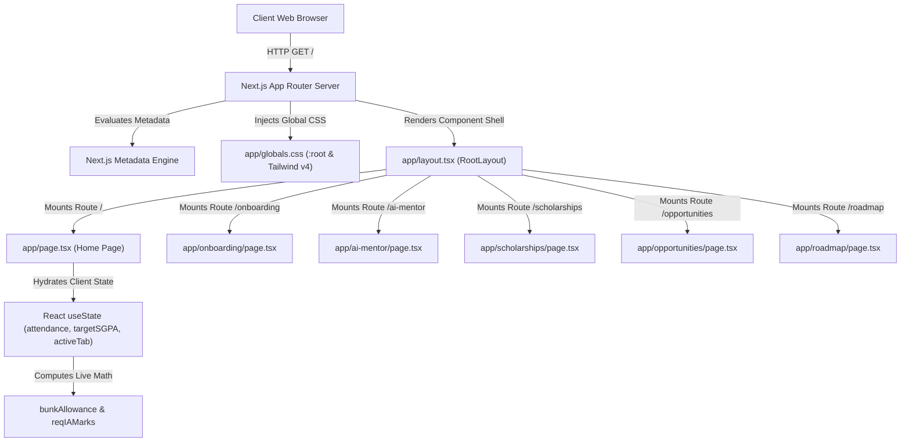

# System Architecture: CampusOS

## Architectural Principles

CampusOS is engineered using modern web application principles with Next.js App Router, React 19, TypeScript, and Tailwind CSS v4:

1. **Server-First Component Default**: Routes render static markup on the server to maximize SEO performance and eliminate layout shift (CLS).
2. **Client Boundaries at Interactivity Nodes**: Interactive elements (sliders, tab selectors, forms) are isolated into client components marked with `"use client"`.
3. **Design System Token Isolation**: Theme colors and glassmorphic opacity tokens are managed centrally in `:root` CSS variables within `globals.css`.
4. **Derived State Synchronization**: Interactive calculators derive output states directly during render rather than synchronizing redundant state via `useEffect`.

---

## High-Level System Architecture

---

## Module Breakdown

### 1. Presentation Layer (`app/`)
* **Root Layout (`app/layout.tsx`)**: Establishes global `<html>` and `<body>` DOM nodes, loads `globals.css`, and exports SEO `Metadata`.
* **Global Styles (`app/globals.css`)**: Imports Tailwind CSS v4, declares design tokens (`--background`, `--card-bg`), and defines glassmorphism utilities (`.glass-panel-interactive`).
* **Route Pages**:
  * `/`: Main landing page, interactive mockup, CIE & attendance simulator, and waitlist form.
  * `/onboarding`: 4-step wizard collecting student college, branch, and target profile details.
  * `/ai-mentor`: Conversational AI query workspace prototype.
  * `/scholarships`: Filterable SSP/NSP scholarship directory.
  * `/opportunities`: Hackathon and internship aggregator.
  * `/roadmap`: 8-semester skill progression.

### 2. State & Business Logic Layer
* **Derived Mathematics Engine**: Computes bunk allowances (`Math.floor((attendance - 75) / 2.5)`) and minimum IA test requirements (`Math.round(targetSGPA * 4)`) in real time.
* **Client State Management**: React `useState` hooks control active tabs, accordion states, and form inputs cleanly without external state management overhead.

---

## Data Flow & Hydration Lifecycle

1. **Initial Request**: The user navigates to a CampusOS route (`/` or `/onboarding`).
2. **Server Execution**: Next.js evaluates the route component on the server, producing static HTML and CSS link headers.
3. **Browser Paint**: The browser displays static HTML immediately (FCP < 0.5s), avoiding blank screens or FOUC.
4. **Hydration**: React loads JavaScript bundles and attaches event handlers (`onClick`, `onChange`, `onSubmit`).
5. **Interactive Lifecycle**: User interactions (moving sliders, submitting waitlist forms) trigger local React state updates, re-rendering affected UI blocks at 60 FPS.
