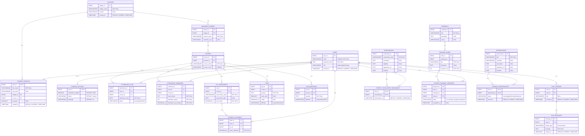

# CampusOS ER Diagram

```mermaid
erDiagram
    USERS ||--o| STUDENT_PROFILES : "1:0..1"
    USERS ||--o| STUDENT_SETTINGS : "1:0..1"
    COLLEGES ||--o{ STUDENT_PROFILES : "1:N"
    COLLEGES ||--o{ ACADEMIC_SCHEMES : "1:N"
    ACADEMIC_SCHEMES ||--o{ COURSES : "1:N"
    USERS ||--o{ ATTENDANCE_LOGS : "1:N"
    COURSES ||--o{ ATTENDANCE_LOGS : "1:N"
    USERS ||--o{ ATTENDANCE_SUMMARIES : "1:N"
    COURSES ||--o{ ATTENDANCE_SUMMARIES : "1:N"
    COURSES ||--o{ CIE_ASSESSMENTS : "1:N"
    USERS ||--o{ STUDENT_CIE_MARKS : "1:N"
    CIE_ASSESSMENTS ||--o{ STUDENT_CIE_MARKS : "1:N"
    COURSES ||--o{ PYQS : "1:N"
    COURSES ||--o{ VIVA_QUESTIONS : "1:N"
    USERS ||--o{ CHAT_THREADS : "1:N"
    CHAT_THREADS ||--o{ CHAT_MESSAGES : "1:N"
    USERS ||--o{ STUDENT_SCHOLARSHIP_BOOKMARKS : "1:N"
    SCHOLARSHIPS ||--o{ STUDENT_SCHOLARSHIP_BOOKMARKS : "1:N"
    ROADMAPS ||--o{ ROADMAP_NODES : "1:N"
    USERS ||--o{ STUDENT_ROADMAP_PROGRESS : "1:N"
    ROADMAP_NODES ||--o{ STUDENT_ROADMAP_PROGRESS : "1:N"
    USERS ||--o{ STUDENT_OPPORTUNITIES : "1:N"
    OPPORTUNITIES ||--o{ STUDENT_OPPORTUNITIES : "1:N"

    USERS {
        BIGINT user_id PK
        VARCHAR(255) email "UNIQUE, NOT NULL"
        TEXT password_hash "NOT NULL"
        VARCHAR(30) role "student/admin/faculty"
        TIMESTAMP created_at "DEFAULT CURRENT_TIMESTAMP"
    }

    STUDENT_PROFILES {
        BIGINT user_id PK,FK
        VARCHAR(100) first_name "NOT NULL"
        VARCHAR(100) last_name "NULL"
        BIGINT college_id FK
        BIGINT course_id FK
        SMALLINT semester "NULL"
        TIMESTAMP created_at "DEFAULT CURRENT_TIMESTAMP"
    }

    STUDENT_SETTINGS {
        BIGINT user_id PK,FK
        BOOLEAN notification_enabled "DEFAULT TRUE"
        VARCHAR(20) theme "DEFAULT 'system'"
        VARCHAR(20) language "DEFAULT 'en'"
    }

    COLLEGES {
        BIGINT college_id PK
        VARCHAR(255) college_name "NOT NULL"
        VARCHAR(255) location "NULL"
        TIMESTAMP created_at "DEFAULT CURRENT_TIMESTAMP"
    }

    ACADEMIC_SCHEMES {
        BIGINT scheme_id PK
        BIGINT college_id FK
        VARCHAR(100) scheme_name "NOT NULL"
        VARCHAR(20) academic_year "NULL"
    }

    COURSES {
        BIGINT course_id PK
        BIGINT scheme_id FK
        VARCHAR(255) course_name "NOT NULL"
        VARCHAR(50) course_code "UNIQUE"
    }

    ATTENDANCE_LOGS {
        BIGINT attendance_id PK
        BIGINT user_id FK
        BIGINT course_id FK
        DATE attendance_date "NOT NULL"
        VARCHAR(20) status "present/absent/late"
    }

    ATTENDANCE_SUMMARIES {
        BIGINT summary_id PK
        BIGINT user_id FK
        BIGINT course_id FK
        INT total_classes "NOT NULL"
        INT attended_classes "NOT NULL"
        DECIMAL(5_2) attendance_percentage "NOT NULL"
    }

    CIE_ASSESSMENTS {
        BIGINT cie_id PK
        BIGINT course_id FK
        VARCHAR(100) assessment_name "NOT NULL"
        DATE assessment_date "NULL"
        DECIMAL(6_2) max_marks "NOT NULL"
    }

    STUDENT_CIE_MARKS {
        BIGINT mark_id PK
        BIGINT user_id FK
        BIGINT cie_id FK
        DECIMAL(6_2) marks_obtained "NOT NULL"
    }

    PYQS {
        BIGINT pyq_id PK
        BIGINT course_id FK
        TEXT question "NOT NULL"
        SMALLINT exam_year "NULL"
        DECIMAL(5_2) marks "NULL"
        VARCHAR(20) difficulty "easy/medium/hard"
    }

    VIVA_QUESTIONS {
        BIGINT viva_id PK
        BIGINT course_id FK
        TEXT question "NOT NULL"
        VARCHAR(20) difficulty "easy/medium/hard"
    }

    CHAT_THREADS {
        BIGINT chat_id PK
        BIGINT user_id FK
        VARCHAR(255) title "NULL"
        TIMESTAMP created_at "DEFAULT CURRENT_TIMESTAMP"
    }

    CHAT_MESSAGES {
        BIGINT message_id PK
        BIGINT chat_id FK
        VARCHAR(20) sender_type "user/assistant"
        TEXT message "NOT NULL"
        TIMESTAMP created_at "DEFAULT CURRENT_TIMESTAMP"
    }

    SCHOLARSHIPS {
        BIGINT scholarship_id PK
        VARCHAR(255) scholarship_name "NOT NULL"
        TEXT description "NULL"
        TEXT eligibility "NULL"
        TEXT application_url "NULL"
        DATE deadline "NULL"
    }

    STUDENT_SCHOLARSHIP_BOOKMARKS {
        BIGINT user_id PK,FK
        BIGINT scholarship_id PK,FK
        TIMESTAMP bookmarked_at "DEFAULT CURRENT_TIMESTAMP"
    }

    ROADMAPS {
        BIGINT roadmap_id PK
        VARCHAR(255) title "NOT NULL"
        TEXT description "NULL"
        VARCHAR(150) career "NULL"
    }

    ROADMAP_NODES {
        BIGINT node_id PK
        BIGINT roadmap_id FK
        VARCHAR(255) title "NOT NULL"
        TEXT description "NULL"
        INT sequence_no "NOT NULL"
    }

    STUDENT_ROADMAP_PROGRESS {
        BIGINT progress_id PK
        BIGINT user_id FK
        BIGINT roadmap_id FK
        BIGINT node_id FK
        VARCHAR(20) status "not_started/in_progress/completed"
        TIMESTAMP completed_at "NULL"
    }

    OPPORTUNITIES {
        BIGINT opportunity_id PK
        VARCHAR(255) title "NOT NULL"
        VARCHAR(255) company "NULL"
        TEXT description "NULL"
        TEXT application_url "NULL"
        DATE deadline "NULL"
    }

    STUDENT_OPPORTUNITIES {
        BIGINT user_id PK,FK
        BIGINT opportunity_id PK,FK
        VARCHAR(30) status "saved/applied/shortlisted/rejected"
        TIMESTAMP saved_at "DEFAULT CURRENT_TIMESTAMP"
    }
```
